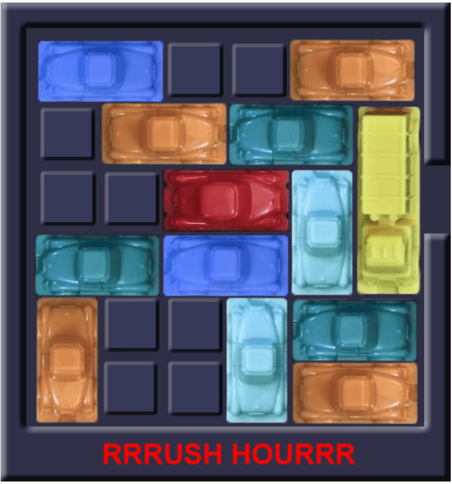

# Rush Hour 
</img>


## Summary 
Rush Hour is a sliding block game where you need to get the red vehicle to the exit. There are other vehicles blocking the road, so they have to be moved in order to create a path to the exit. To solve these puzzles, our team implemented different algorithms to see which one solved the games the best.

The algorithms we used are A* and Breadth First.


## Getting Started
To get started, you need to have python3 and pip installed. 
Once you've done that and cloned the repository, run the following command in your terminal: 

```
pip install -r requirements.txt
```

To play a game, run:
```
python3 rushhour.py data/filename.csv
```
where filename is the name of the game that you want to play, for example: data/Rushhour6x6_1.csv


## Choose Algorithm
To choose a specific algorithm, you need to uncomment which one in ```rushhour.py```.

In the ```main``` function, you will see a for loop that can help with running the algorithm a certain amount of times. To change the number of iterations, simply fill in an integer at the ```total_iterations``` variable.

To choose an algorithm, you can uncomment the one you want to run. To find the lines to uncomment, look for the comments with a long line and follow further instructions.


## Structure
Our repository is structured as follows:

* code/algorithms:
    * ```a_star.py```:

    * ```breadth_1.py```: checks each child grid horizontally, starting from the left and returns the shortest path.

    * ```random.py```: randomly chooses vehicle and direction and makes that move if possible until the red car is at the exit coordinate.

* code/classes:
    * ```grid.py```: contains the Grid class, where a grid and the necessary vehicles are loaded onto a board. It also contains methods to move, visualize the vehicles. Lastly it contains a method that checks if a game is won.

    * ```vehicle.py```: contains the Vehicle class, which is used to create vehicle objects that are then placed on the grid.

* code/visualisation:
    * ```visualisation.py```: contains code that creates a scatterplot of solutions found for the chosen game using the random algorithm.

* data:
    * This folder contains the data for each game.

* docs:
    * This file contains a gif that shows game two being solved.


### Team - The three programmers
* David Adriaanse
* Pieternel Bax
* Melissa Sam-Sin
